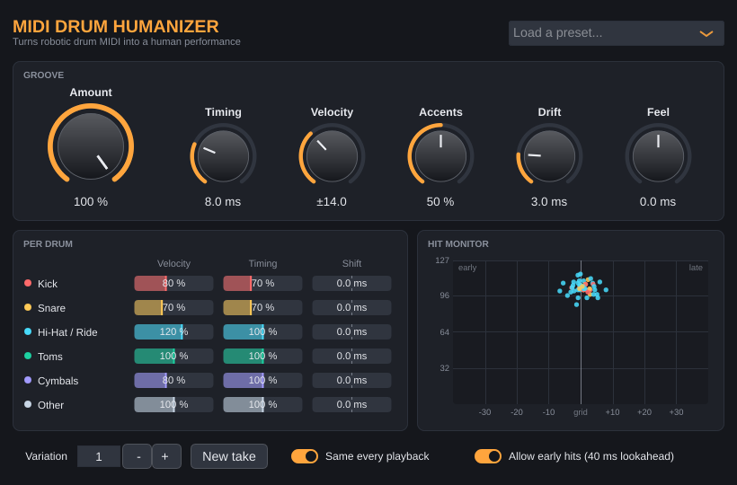

# MIDI Drum Humanizer

A VST3 (and AU on macOS) MIDI effect that makes programmed drums sound like a real
drummer played them. Put it on a drum track in front of your drum instrument. A
completely robotic part, where every note has the same velocity and sits exactly on
the grid, comes out with:

- **Human velocities.** Each hit gets a slightly different velocity. Most hits stay
  close to the original and a few go further, like a real player.
- **Beat-aware accents.** Downbeats and backbeats come out stronger and off-beat 16ths
  softer. The effect is strongest on hi-hats and ride.
- **Human timing.** Hits land a few milliseconds early or late. A slow "drift" makes
  the whole kit breathe with the groove rather than jitter at random.
- **Per-drum control.** Kick, snare, hi-hat/ride, toms, cymbals and other percussion
  each get their own amount, plus a constant shift (for example a lazy, late snare).
- **Repeatable takes.** Every playback and every render sounds exactly the same, so you
  can mix with confidence. Change the *Variation* number (or press *New take*) to get a
  different performance.

The original MIDI items are never modified. Set *Amount* to 0 % and the drums play
exactly as programmed.



## Download and install

Prebuilt plugins for Windows, macOS and Linux are produced automatically by GitHub
Actions:

- **Tagged releases:** see the repository's *Releases* page.
- **Latest build:** *Actions* tab → *Build* workflow → latest successful run →
  *Artifacts* at the bottom of the page (for example `MIDI-Drum-Humanizer-Windows`).

Unzip the download and copy `MIDI Drum Humanizer.vst3` into your VST3 folder:

| OS      | Folder |
|---------|--------|
| Windows | `C:\Program Files\Common Files\VST3\` |
| macOS   | `~/Library/Audio/Plug-Ins/VST3/` (the AU `.component` goes into `~/Library/Audio/Plug-Ins/Components/`) |
| Linux   | `~/.vst3/` |

On **macOS** the plugin is not notarized, so remove the download quarantine once:

```sh
xattr -dr com.apple.quarantine ~/Library/Audio/Plug-Ins/VST3/"MIDI Drum Humanizer.vst3"
```

## Using it in REAPER

1. *Options → Preferences → Plug-ins → VST → Re-scan* (only needed the first time).
2. Open the FX chain of your drum track and add **MIDI Drum Humanizer**.
3. Make sure it sits **above** (before) your drum instrument in the chain, for example
   `MIDI Drum Humanizer` → `ReaSamplOmatic5000` / `MT Power Drum Kit` / `EZdrummer` / ...
4. Press play and pick a preset, or adjust the knobs. The *Hit Monitor* shows every hit:
   left/right is how early or late it was moved, and up/down is its new velocity.

Tips:

- *Allow early hits* adds a fixed 40 ms of latency so that hits can also land **before**
  the beat. REAPER compensates for this automatically on playback and render. Turn it
  off while recording live through the track. Hits can then only be delayed, never
  moved early.
- To print the humanization into the MIDI itself, bypass the drum instrument
  temporarily, then right-click the MIDI item and choose *Apply track/take FX to items
  as new take (MIDI output)*. Most drum instruments don't pass MIDI on, so bypassing
  lets the humanized notes reach the end of the chain. The original stays as the
  previous take.
- The plugin passes all other MIDI (hi-hat pedal CCs, pitch bend, ...) through unchanged.

## Controls

| Control | What it does |
|---------|--------------|
| **Amount** | Master intensity; scales timing, velocity, accents and drift together. |
| **Timing** | Maximum random timing deviation (ms). Most hits stay within a third of it. |
| **Velocity** | Maximum random velocity deviation (MIDI velocity steps). |
| **Accents** | Beat-aware dynamics: stronger downbeats and backbeats, softer off-beat 16ths. |
| **Drift** | Slow, smooth timing wander over a couple of beats. |
| **Feel** | Moves everything ahead of the beat (negative, pushing) or behind it (positive, laid back). |
| **Per drum: Velocity / Timing** | How much of the global randomness each drum gets (100 % = the knob value). |
| **Per drum: Shift** | Constant timing offset for one drum, e.g. +5 ms on the snare. |
| **Variation / New take** | Selects a different but repeatable performance. |
| **Same every playback** | On: every playback and render is identical. Off: each playback is a new take. |
| **Allow early hits** | Enables the 40 ms lookahead so hits can land before the beat (see above). |

Double-click a knob or slider to reset it. Hover over a control for a short explanation.

### Drum map

Notes are grouped using the General MIDI drum map, which most drum plugins follow:

| Group | Notes |
|-------|-------|
| Kick | 35, 36 |
| Snare | 37 (side stick), 38, 40 |
| Hi-Hat / Ride | 42, 44, 46 (hi-hat), 51, 53, 59 (ride) |
| Toms | 41, 43, 45, 47, 48, 50 |
| Cymbals | 49, 57 (crash), 52 (china), 55 (splash) |
| Other | everything else |

Notes outside this map (extra articulations of some libraries) are still humanized, using
the *Other* settings.

## How it works

- Timing: a real-time plugin cannot see the future, so to move a hit *earlier* the
  plugin delays everything by a fixed 40 ms lookahead and reports it to the host as
  latency. Each hit is then placed anywhere between 40 ms early and 100 ms late.
  Note-offs keep their note's length, and two hits on the same drum never swap order.
- Randomness is derived from each note's musical position (bar/beat), the note number
  and the *Variation* number. That is why playback is repeatable and independent of
  buffer size.
- Accents come from the note's position in the bar, read from the host's transport. The
  plugin understands simple meters (4/4, 3/4, 7/8, ...) and compound meters (6/8, 12/8).

## Building from source

Requirements: CMake 3.22+, a C++17 compiler (Visual Studio 2022, Xcode, GCC or Clang)
and git. JUCE 8 is downloaded automatically during configuration.

```sh
cmake -S . -B build -DCMAKE_BUILD_TYPE=Release
cmake --build build --config Release
ctest --test-dir build -C Release        # engine unit tests
```

The plugin ends up in `build/MidiDrumHumanizer_artefacts/Release/VST3/`. Add
`-DMDH_COPY_PLUGIN_AFTER_BUILD=ON` to install it into your system plugin folder
automatically. On Linux you need the usual JUCE dependencies (see
`.github/workflows/build.yml`).

Project layout:

- `src/engine/`: the humanizer itself, plain C++ without JUCE (unit tested in `tests/`)
- `src/plugin/`: the JUCE plugin (parameters, audio/MIDI processing, user interface)

## License

The plugin is built with [JUCE](https://juce.com). JUCE is dual-licensed under the
AGPLv3 and the commercial JUCE licence, so if you distribute binaries of this plugin you
need to comply with one of them.
